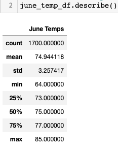
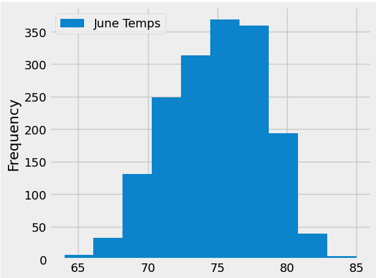
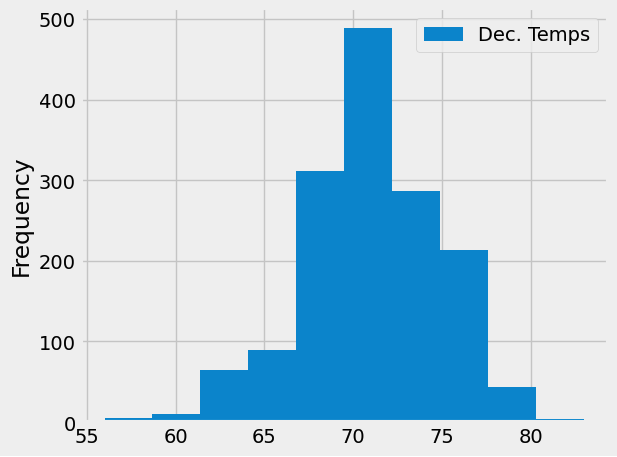

# surfs_up

## Overview
In this analysis we worked to compile some data to obtain funding for an ice-cream and surf shop on the island of Awahoo, Hawaii. We'll look at weather data to understand if the idea is sound and prepare it to show to potential investors.  

### Resources

- Software:
    - Visual Studio Code (Version: 1.76.2)
    - Jupyter Notebook
- Starting Data: 
    - Hawaii Weather Data [resources/hawaii.sqlite]( resources/hawaii.sqlite)

## Results

### Generated Code 

- Surfs-Up Challenge Code
    - [code/SurfsUp_Challenge.ipynb](code/SurfsUp_Challenge.ipynb)
    
### Major Points and Visualizations

- The temperature statistics for June show that the average temp was 74.94*, the minimum was 64* and the maximum temp was 85*. 
- The temperature statistics for December show that the average temp was 71.04*, the minimum was 56* and the maximum temp was 83*. 
- The standard deviation is 3.26 in June and 3.75 in December, this creates about a 0.5 difference in the two seasons we have represented. 
- The histograms plotted below show that the spread of warm days in June is more evenly distributed with the highest number of data points at 75* while in December the distribution is less even and we see the greatest number of data points coming in at 70*. 

#### June Temperature Statistics 

[images/june_temp_df_stats.png](images/june_temp_df_stats.png)

#### June Temperature Histogram 

[images/june_temps_hist.png](images/june_temps_hist.png)

#### December Temperature Statistics 

[images/dec_temp_df_stats.png](images/dec_temp_df_stats.png)

#### December Temperature Histogram 

[images/dec_temps_hist.png](images/dec_temps_hist.png)

### Summary of Findings 

Our initial step is to prep the data. We first retrieved some weather data from ideal dates and prepared it for analysis. After a first pass we gain lots of insight and deduce that it would be a good idea to drill down into a few specific months out of the year in order to do a deeper analysis on important times frames. 

Looking at June we find that that the average temp was 74.94*, the minimum was 64* and the maximum temp was 85*.  The median and the average are 0.1* difference and the standard deviation is 3.26. 

Looking at December we find that the average temp was 71.04*, the minimum was 56* and the maximum temp was 83*.  The median and the average are only 0.04* difference and the standard deviation is 3.75.

When we compare this data, we understand that while there is not a minimal difference in the maximum temperatures, just 2*, there is a much larger difference of 8* in the minimum temperatures.  The histograms plotted show that the spread of warm days in June is more evenly distributed with the highest number of data points at 75* while in December the distribution is less even, and we see the greatest number of data points coming in at 70*.  These visualizations help us understand that weather we are in summer or winter, there will be a lot of days of 70-80* weather and that can only be a good thing with an ice-cream and surf shop. 

If I were to preform further analysis, I would want to look at cloud coverage and understand how many warm days correlate with sunny days. In contrast, we could also see how many days precipitation coincides with cooler days. 

 
