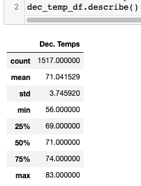

# surfs_up

## Overview
In this analysis we worked to compile some data to obtain funding for an ice-cream and surf shop on the island of Awahoo, Hawaii. We look at weather data to first understand if the idea is sound and secondly where on the island will be ideal for the location of the shop. 

### Resources

- Software:
    - Visual Studio Code (Version: 1.76.2)
    - Jupyter Notebook
- Starting Data: 
    - Hawaii Weather Data [resources/hawaii.sqlite]( resources/hawaii.sqlite)

## Results

### Generated Code 

- Surfs-Up Challenge Code
    - [code/SurfsUp_Challenge.ipynb](code/SurfsUp_Challenge.ipynb)
    
### Major Points and Visualizations

#### June Temperature Statistics 
[images/june_temp_df_stats.png](images/june_temp_df_stats.png)

#### June Temperature Histogram 
[images/june_temps_hist.png](images/june_temps_hist.png)

#### December Temperature Statistics 
[images/dec_temp_df_stats.png](images/dec_temp_df_stats.png)

#### December Temperature Histogram 
[images/dec_temps_hist.png](images/dec_temps_hist.png)

### Summary of Findings 

Our initial step is to prep the data. We first retrieved some weather data from ideal dates and prepared it for analysis. After a first pass we gain lots of insight and deduce that it would be a good idea to drill down into a few specific months out of the year in order to do a deeper analysis on important times of the year. 

Looking at June we find that 
Looking at December we find that 

 
